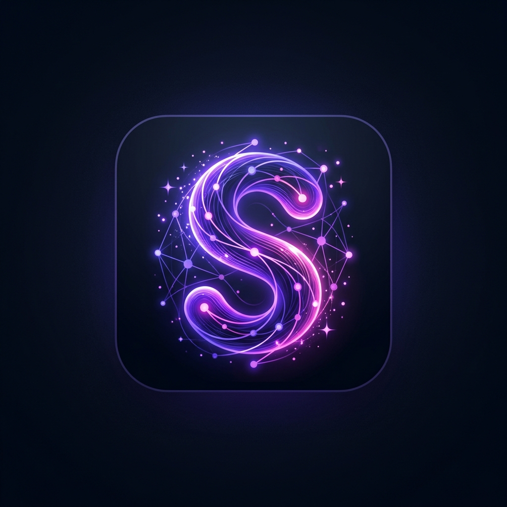

#  SummifyAI

> Transform complex documents, PDFs, and long paragraphs into clear, concise summaries or simplified explanations instantly using Google Gemini.

SummifyAI is a production-ready Next.js application that provides AI-powered content generation, PDF text extraction, and smart reading history tracking. It features secure user authentication via Clerk, robust rate-limiting via Upstash Redis, and database persistence powered by Supabase.

---

## 🚀 Key Features

*   ✨ **AI Summarizer & Explainer**: Leverage Gemini 2.5 Flash to generate custom outputs: Standard Summary, ELI5 (Explain Like I'm 5), Key Bullet Points, or Deep-Dive analysis.
*   📄 **PDF parsing & Ingestion**: Streamlined server-side PDF text extraction powered by `unpdf` (Turbopack compatible, dependency-free).
*   ⚡ **Vercel AI SDK Streaming**: Zero-loading spin states. Watch the AI construct summaries character-by-character in real-time.
*   💾 **Persistent Reading Logs**: Automated background persistence to Supabase. View, copy, or delete your previous summaries anytime.
*   🛡️ **Production Rate Limiting**: Token-bucket rate limiting via Upstash Redis to prevent abuse and manage API costs.
*   🔐 **Secure Clerk-Supabase RLS**: Integrated JWT token exchange with Row Level Security (RLS) to keep user data private.

---

## 🛠️ Tech Stack

*   **Framework**: [Next.js](https://nextjs.org/) (App Router, TypeScript, React 19)
*   **AI Engine**: [Google Gemini 2.5 Flash](https://ai.google.dev/) via [Vercel AI SDK](https://sdk.vercel.ai/)
*   **Authentication**: [Clerk](https://clerk.com/)
*   **Database**: [Supabase](https://supabase.com/) (PostgreSQL with RLS)
*   **Caching & Limiting**: [Upstash Redis](https://upstash.com/)
*   **Styling**: [TailwindCSS](https://tailwindcss.com/) & Lucide Icons

---

## 📂 Repository Structure

```text
├── public/                 # Static assets (including brand logo)
├── src/
│   ├── app/                # Next.js App Router
│   │   ├── api/
│   │   │   ├── generate/   # AI generation & streaming API
│   │   │   ├── history/    # Read/Write/Delete database routes
│   │   │   └── parse-pdf/  # PDF upload & unpdf parsing API
│   │   ├── dashboard/      # Main application workspace
│   │   ├── sign-in/        # Authentication pages
│   │   ├── sign-up/
│   │   ├── globals.css     # Global styles
│   │   ├── layout.tsx      # Main layout (Clerk Provider wrapped)
│   │   └── page.tsx        # Responsive landing page
│   ├── lib/                # Shared utilities
│   │   ├── ratelimit.ts    # Upstash ratelimit config
│   │   ├── redis.ts        # Redis client initialization
│   │   └── supabase.ts     # Supabase client generator with Clerk JWT support
└── schema.sql              # Database table schemas and RLS policies
```

---

## ⚙️ Environment Variables

Create a `.env.local` file in the root directory. Use the following keys:

```env
# Clerk Authentication
NEXT_PUBLIC_CLERK_PUBLISHABLE_KEY=pk_test_...
CLERK_SECRET_KEY=sk_test_...
NEXT_PUBLIC_CLERK_SIGN_IN_URL=/sign-in
NEXT_PUBLIC_CLERK_SIGN_UP_URL=/sign-up
NEXT_PUBLIC_CLERK_SIGN_IN_FORCE_REDIRECT_URL=/dashboard
NEXT_PUBLIC_CLERK_SIGN_UP_FORCE_REDIRECT_URL=/dashboard

# Supabase Database Configuration
NEXT_PUBLIC_SUPABASE_URL=https://your-project-id.supabase.co
NEXT_PUBLIC_SUPABASE_ANON_KEY=your-anon-key
SUPABASE_SERVICE_ROLE_KEY=your-service-role-key

# Upstash Redis Cache & Rate Limiting
UPSTASH_REDIS_REST_URL=https://your-redis-name.upstash.io
UPSTASH_REDIS_REST_TOKEN=your-redis-token

# Google Gemini API Configuration
GEMINI_API_KEY=your-gemini-api-key

# App Settings
NEXT_PUBLIC_APP_URL=http://localhost:3000
```

> [!NOTE]
> If Supabase or Upstash keys are omitted, the application will still launch in a demo mode, but history saving and API rate-limiting will display warning logs.

---

## 🔑 Clerk & Supabase Integration (RLS)

To secure user history records, this app uses Supabase Row Level Security (RLS) checked against Clerk user session JWT tokens.

### 1. Database Setup
Run the SQL definitions from [schema.sql](schema.sql) in your Supabase SQL editor. This creates the `generations` table, indexes, and custom policies to authorize users based on the request's JWT claims:
```sql
CREATE POLICY "Users can insert their own generations" 
ON generations FOR INSERT TO public 
WITH CHECK (
  auth.uid()::text = user_id 
  OR (nullif(current_setting('request.jwt.claims', true), '')::jsonb ->> 'sub') = user_id
);
```

### 2. Configure Clerk JWT Template
To authorize API calls, you **must** configure a JWT Template inside Clerk. Otherwise, calls to `getToken({ template: 'supabase' })` will throw a `JWT template not found` 404 error:
1. Go to your **Clerk Dashboard**.
2. Select **JWT Templates** from the sidebar menu.
3. Click **New Template** and choose **Supabase**.
4. Save the template with the name `supabase` (this matches the query template requested in the code).

---

## ⚡ Quick Start

### 1. Install dependencies
```bash
npm install
```

### 2. Run the Development Server
```bash
npm run dev
```
Open [http://localhost:3000](http://localhost:3000) to view the application.

---

## 🚀 Production Deployment

Deploy the project on Vercel or any server node environment supporting Next.js 15+:
*   Ensure all keys in `.env.local` are added as environment variables in your deployment host environment.
*   To build a production build locally, run:
    ```bash
    npm run build
    npm run start
    ```
